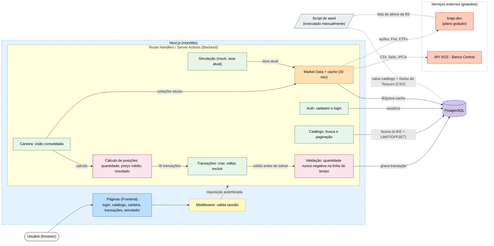

# Documento de Arquitetura — Entregável 1

## Projeto

Sistema de gestão de investimentos pessoais, permitindo ao usuário acompanhar rendas fixas e variáveis, montar e gerenciar carteiras, registrar suas transações e simular novos investimentos.

## Funcionalidades principais

- Exibição de listagem de rendas fixas e variáveis
- Listagem dos investimentos em posse
- Simulação de investimento
- Cadastro de investimentos
- Edição das carteiras
- Visão da carteira
- Login e Cadastro

## Tipos de usuário

### Usuário Comum (Free)

Único tipo de usuário do sistema:

- **Autenticação**: login, cadastro, recuperação de senha e edição de perfil
- **Carteiras**: criar, editar e excluir carteiras (com limites do plano gratuito)
- **Investimentos**: cadastrar, editar e excluir ativos (renda fixa e variável)
- **Visualização**: dashboard geral, listagens de investimentos em posse e separadas por tipo
- **Simulação**: acesso livre às simulações básicas

## Diagrama de arquitetura

## Entidades principais

| Entidade | Descrição | Atributos essenciais |
|---|---|---|
| **Usuário** | Conta do investidor | id, nome, email, senha (hash), criadoEm |
| **Carteira** | Agrupamento de investimentos de um usuário | id, usuarioId, nome, criadoEm |
| **Ativo** | Item do catálogo disponível para investir (renda fixa ou variável) | id, ticker/código, nome, tipo (ação, FII, ETF, Tesouro, CDB etc.), origem (brapi/BCB/seed) |
| **Transação** | Compra ou venda de um ativo dentro de uma carteira | id, carteiraId, ativoId, tipo (compra/venda), quantidade, preçoUnitário, data |
| **Cotação** | Cache de valores de mercado dos ativos | id, ativoId, valor, fonte (brapi/BCB), atualizadoEm |

> **Observação:** a posição consolidada de uma carteira (quantidade total, preço médio, resultado) não é uma entidade persistida — é **calculada** dinamicamente a partir das Transações, conforme indicado no diagrama (`cálculo de posições`).

## Endpoints da API

### Auth
- `POST /api/auth/cadastro`
- `POST /api/auth/login`
- `POST /api/auth/logout`
- `POST /api/auth/recuperar-senha`
- `GET /api/auth/perfil`
- `PATCH /api/auth/perfil`

### Catálogo
- `GET /api/catalogo?tipo=&q=&page=&limit=` — busca e paginação de ativos disponíveis (renda fixa/variável)

### Carteiras
- `GET /api/carteiras`
- `POST /api/carteiras`
- `GET /api/carteiras/:id` — visão consolidada (dashboard)
- `PATCH /api/carteiras/:id`
- `DELETE /api/carteiras/:id`

### Transações (investimentos dentro de uma carteira)
- `GET /api/carteiras/:id/transacoes`
- `POST /api/carteiras/:id/transacoes`
- `PATCH /api/carteiras/:id/transacoes/:transacaoId`
- `DELETE /api/carteiras/:id/transacoes/:transacaoId`
- `GET /api/carteiras/:id/posicoes` — posição consolidada (quantidade, preço médio, resultado)

### Simulação
- `POST /api/simulacoes` — simula um investimento com base na taxa/cotação atual

### Cotações (mercado)
- `GET /api/cotacoes/:ativoId` — cotação atual do ativo, com cache de 30 minutos

## Tecnologia definida

- **Frontend + Backend**: Next.js (monólito) — páginas React no frontend; Route Handlers/Server Actions no backend; middleware para validação de sessão
- **Banco de dados**: PostgreSQL (relacional, dados reais — não mockado)
- **Integrações externas**: brapi.dev (ações, FIIs, ETFs — plano gratuito) e API SGS do Banco Central (CDI, Selic, IPCA)
- **Carga inicial**: script de seed executado manualmente, populando o catálogo com a lista de ativos da B3 (via brapi) e títulos do Tesouro (via CSV)
